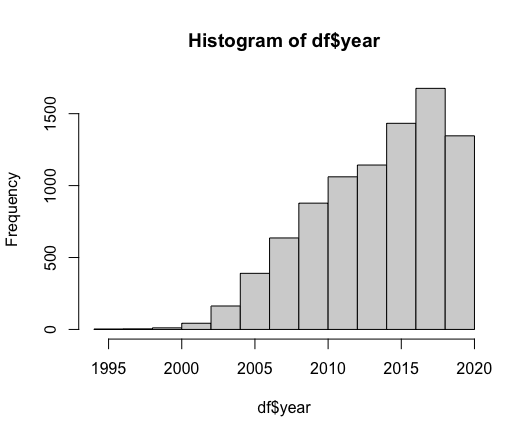

# Blog post: an example on Vintage Sparse PCA

---
- Stats 992 Class Project
- Shuqi Yu & Xiyu Yang
---

## 1 The background and main question

Semantic Scholar Open Research Corpus contains research papers published in
all fields and is provided as an easy-to-use JSON archive. There are about 220
million papers and over 100Gb meta data. We study the citation network and
term-abstract network on this massive collection of academic publications.

&nbsp;&nbsp;&nbsp;&nbsp;&nbsp;&nbsp;This post is an starting example toward our course project, and we focus
on all papers relate to a good technique "false discovery rate" or "FDA" in
short here. The FDR conceptualize the rate of type I errors in null hypothesis
testing with multiple comparisons. The FDR was first formally introduced by
Benjamini and Hochberg in 1995 [1]. It has been particularly influential and
gain broad acceptance in many scientific fields including life sciences, genetics,
biochemistry, oncology and plant sciences. Thus we can expect a good sample
size and some good clustering result in this example.

&nbsp;&nbsp;&nbsp;&nbsp;&nbsp;&nbsp;We first set all papers that mention "false discovery rate" in their abstract as
our data-set, then we consider the community detection and cluster the data-set
by citations (both in-Citations and out-Citations) using vintage sparse principle 
component analysis (VSP). Next, we redo the clustering for the Cititation
networks using bag-of-words representation of the abstracts (BFF). Finally, we
do the comparison across the classes, such as the class size, the first published
year and the regression along the time (in the next step toward the project).

## 2 The implementation

The coding provided below is adapted from the scripts on Karl Rohe's GitHub
repository, semanticScholar.

### 2.1 Building the dataset

We filter the target papers from the raw data and rewrite them into csv in this
step.

Using function processDataFiles(includeLine, processLine, outputPath) for scanning 
through the raw data.

* If x is a line of data, then the function includeLine(x) indicates whether this line should be processed. In the following example, if the abstract of the data contains the phrase, "false discovery rate", regardless of its letter case, the line of data will be processed.

* If includeLine(x)=T, then processLine(x) is written to a new line of data/outputPath/xxx.csv where xxx is the name of the file from which x was drawn.
The processLine(x) function below converts the data into a tibble with
eleven columns: 

  + paper ID
  + paper title
  + abstract
  + published year
  + fields of study
  + list of author IDs and names
  + list of paper IDs which cited this paper (inCitation)
  + list of paper IDs which this paper cited (outCitation)
  + name of the journal that published this paper
  + the volume of the journal where this paper was published
  + the pages of the journal where this paper was published.

```r
includeLine = function(x) {
  if(nchar(x$paperAbstract) == 0) return(F) 
  grepl("false discovery rate|False Discovery Rate|False discovery rate", x$paperAbstract)
}

processLine = function(x) tibble(
  id = x$id,
  title = x$title,
  abstract = x$paperAbstract,
  year = x$year,
  field = paste(x$fieldsOfStudy, collapse='; '),
  author = paste(x$authors, collapse='; '),
  inCitation = paste(x$inCitations, collapse='; '),
  outCitation = paste(x$outCitations, collapse='; '),
  journalName = x$journalName,
  journalVolume = x$journalVolume,
  journalPages = x$journalPages)
  
outputPath = "FDR"
processDataFiles(includeLine, processLine, outputPath)
```

### 2.2 Clustering by VSP

**STEP 1**: We construct the adjacent matrix $ A $ of paper-inCitations network,
namely,

$$A_{ij} = \mathbb{1} (\text{Paper } i \text{ is cited by paper } j)$$

We achieve this by building the vertex set $E$ and edge set $V$ , and combine them
using function cast_sparse():

```r
# identifier
inCitations = df %>% 
  select(inCitation) %>% 
  unnest_tokens(word, inCitation) %>% 
  rename(id = word)

paper_ids = df %>% 
  select(id) %>% 
  rbind(inCitations) %>% 
  unique()

identifiers_in = paper_ids %>% 
  mutate(identifier_in = 1:nrow(paper_ids))

# edge list
edgeList_in = df %>% 
  select(id, inCitation) %>% 
  unnest_tokens(word, inCitation) %>% 
  rename(inCitation = word) %>% 
  left_join(identifiers_in, by = "id") %>% 
  select(identifier_in, inCitation) %>% 
  rename(id = identifier_in)

edgeList_in = edgeList_in %>% 
  left_join(identifiers_in, by=c("inCitation" = "id")) %>% 
  select(id, identifier_in) %>% 
  rename(inCitation = identifier_in)

# adjacency matrix
adjMatrix = cast_sparse(edgeList_in, id, inCitation)
```

**STEP 2**: We repeat this step and construct the the adjacent matrix $\hat{A}$ of
paper-outCitations network,

$$\hat{A}_{ij} = \mathbb{1} (\text{Paper } i \text{ cites paper } j)$$

**STEP 3**: We repeat the above step and build the the adjacent matrix $\tilde{A}$ of
paper-abstract network,

To construct this matrix, we first remove all the numbers from the abstracts
in the data set. Next, we convert abstracts into tokens (words) using the
unnest tokens(word, text) function from R package, tidytext. We then remove
the most common words from the list by anti-joining the stopwords dataset
provided by tidytext.

```r
# edge list
df$abstract = str_replace_all(df$abstract, "[:digit:]", "")

edgeList = df %>% 
  select(id, abstract) %>% 
  unnest_tokens(word, abstract) %>% 
  anti_join(stop_words) %>% 
  rename(abstract = word) %>% 
  left_join(identifiers, by = "id") %>% 
  select(identifier, abstract) %>% 
  rename(id = identifier)
```

We will not apply VSP on this matrix. Instead, we will use this matrix as an
external information to illustrate the features of clusters in paper-inCitations
network and paper-outCitations network.

**STEP 4**: Finally, we apply the VSP on the adjacency matrix $A$ (and $\hat{A}$ respectively).

The VSP is a spectral method that combines principal components analysis
(PCA) with the varimax rotation. This algorithm was introduced by Rohe and
Zeng [2] recently and there is a R package available on GitHub. Under mild
assumptions, the VSP estimator is consistent for degree-corrected Stochastic
Blockmodels. Roughly, the algorithm contains three steps: centering the matrix; 
applying singular value decomposition(SVD) to get the top k left and right
singular vectors; rotating these singular vectors to achieve the maximize 
Varimax. The centering step is optimal, but it can surprising speed up the 
algorithm when the matrix is sparse.

We Apply function vsp() and set rank $k = 3$ for $A$ ($\hat{A}$, respectively).

```r
# apply vsp
fa_out = vsp(A_out, rank = 6, scale = TRUE, rescale = FALSE)
plot_varimax_z_pairs(fa_out, 1:6)

fa_in = vsp(A_in, rank = 5, scale = TRUE, rescale = FALSE)
plot_varimax_z_pairs(fa_in, 1:5)

# scree plots
plot(fa_out$d)
plot(fa_in$d)
```

### 2.3 Clustering by BFF

By using BFF, we partition citation graph and interpret the clusters by analyzing 
the paper abstracts using bag-of-words. This algorithm was introduced by
Wang and Rohe [3]. The main idea of BFF is finding the clusters that maximize
the difference of proportion of abstracts containing some words or not.

**Step1**: we simplify the inCitation adjacent matrix $A$ and apply the function bff().

```r
# simplify matrix, A_abs, for bff on incitations
id_in = edgeList_in %>% select(id) %>% unique()
id_in = id_in$id
A_abs_in = A_abs[id_in, ]

# apply bff on inCitation adjacency matrix
keypapers_in = bff(fa_in$Z, A_abs_in, 20) %>% t ## cluster by rows (fa$Z)
keypapers_in %>% t %>% View
```

**Step2**: we repeat the previous step on outCitation adjacent matrix $\hat{A}$.

## 3 The results

Our target dataset(see Figture 1) contains 8787 papers with 11 variables: id,
title, abstract, year, field, author, inCitation, outCitation, journalName, journalVolume, journalPages.



Figure 1: The histogram of year of the target dataset: the first paper is released
in 1995 and there is a clear increase trend along the time.

After the clustering by vsp, we show the scree plots with rank $k = 30$ in
Figure 2.

.png)

.png)

Figure 2: The scree plots with rank 30. The first figure corresponds to the
inCitaion adjacent matrix $A$, the second figure corresponds to the outCitaion
adjacent matrix $\hat{A}$.

They both have a gap between the third and the forth eigenvalue, so there
are at least 3 reasonable classes here. We can pick $k = 3$, and plot their top
three principal components in Figure 3. For the figure on the left, there are clear
$L$-shapes in each scatter plots. However for the figure on the right, the scatter
plot on the left bottom corner doesn't have a prefect $L$-shape which indicates
the rank greater than 3. Indeed, it's unreliable to guess the rank k by simply
observing the gap on the scree plot, so we redo the clustering by analyzing the
paper abstracts using bag-of-words, and we don't mind the eigengap in this way.

.png)

.png)

Figure 3: The scatter plots for the three leading principal components. The first
figure corresponds to the inCitaion adjacent matrix $A$, the second figure 
corresponds to the outCitaion adjacent matrix $\hat{A}$.

For the inCitation network, we find 3 meaningful clusters (see Table 1).

* V1: statistics
* V2: proteomics
* V3: genetics

|V1|V2|V3|
|:--------:|:--------:|:--------:|
|hypotheses|peptide|conditional|
|procedures|identifications|gwas|
|null|peptides|loci|
|procedure|spectra|shared|
|controlling|proteomics|pleiotropic|
|testing|search|summary|
|proportion|decoy|wide|
|error|mass|overlap|
|problem|database|pleiotropy|
|statistics|matches|enrichment|
|benjamini|spectrum|genetic|
|hochberg|tandem|epidemiological|
|true|spectrometry|genome|
|proposed|ms|schizophrenia|
|power|identification|polygenic|
|rejections|protein|phenotypes|
|rejected|proteins|statistics|
|dependence|shotgun|association|
|simulation|engines|conjunctional|
|paper|proteomic|snps|


Table 1: The bag-of-words reults with k = 3. Each column contains the top
twenty representative words in the cluster.

For the outCitation network, we find 7 meaningful clusters(see Table 2).

* V1: hypothesis testing
* V2: proteomics
* V3: gene expression
* V4: genetic variations in human
* V5: genetic variations in plant
* V6: regression
* V7: DNA methylation

|V1|V2|V3|V4|V5|V6|V7|
|:-----:|:-----:|:-----:|:-----:|:-----:|:-----:|:-----:|
|hypotheses|peptide|seq|snps|linkage|lasso|methylation|
|null|proteomics|sequencing|gwas|disequilibrium|selection|cpg|
|procedures|peptides|rna|genetic|breeding|knockoff|cpgs|
|testing|identifications|expression|variants|nucleotide|sparse|dna|
|procedure|spectra|expressed|association|snp|variables|epigenetic|
|error|spectrometry|differentially|loci|snps|procedure|methylated|
|controlling|mass|genes|nucleotide|traits|dimensional|epigenome|
|multiple|search|gene|wide|marker|knockoffs|beadchip|
|microarray|database|differential|polymorphisms|association|variable|blood|
|simulation|ms|reads|genome|population|regression|wide|
|proposed|tandem|transcriptome|rs|populus|asymptotically|infinium|
|hypothesis|proteins|read|snp|single|penalized|humanmethylation|
|proportion|decoy|biological|single|ld|finite|sites|
|benjamini|protein|transcriptional|traits|trait|gaussian|genes|
|tests|spectrum|transcripts|risk|phenotypic|power|cg|
|statistics|identification|edger|phenotypes|polymorphisms|paper|gene|
|hochberg|matches|regulation|pleiotropy|wood|propose|differentially|
|power|proteome|regulated|associations|tomentosa|inference|microarray|
|rejections|engines|pathways|trait|assisted|linear|expression|
|distribution|spectral|deseq|schizophrenia|plant|prove|cohort|
|paper|shotgun|throughput|polygenic|markers|control|association|
|true|mascot|replicates|susceptibility|variation|theoretical|dnam|
|familywise|proteomic|enriched|shared|genotyped|applications|illumina|
|probability|searching|degs|conditional|associations|penalty|cord|
|values|sequest|transcription|disease|mapping|asymptotic|maternal|

Table 2: The bag-of-words reults with k = 7. Each column contains the top
twenty representative words in the cluster.

These two clustering results are consistent since V1&V6 in Table 2 is in statistics 
field and V3-V5&V7 are in genetics field. However the latter one provide more 
detailed clusters.

Inspired the bag-of-words results above, we redo the vsp on the outCitation
adjacent matrix with rank 7.

.png)

Figure 4:  The scatter plots for the seven leading principal components 
corresponds to the outCitaion adjacent matrix $\hat{A}$.


## References

[1] Yoav Benjamini and Yosef Hochberg. Controlling the false discovery rate:
a practical and powerful approach to multiple testing. Journal of the Royal
statistical society: series B (Methodological), 57(1):289-300, 1995.

[2] Karl Rohe and Muzhe Zeng. Vintage factor analysis with varimax performs
statistical inference. arXiv preprint arXiv:2004.05387, 2020.

[3] Song Wang and Karl Rohe. Don't mind the (eigen) gap.